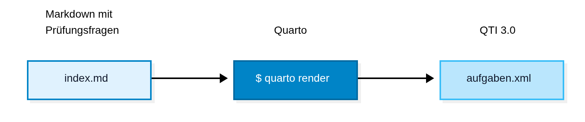

## Integrierte Lern-, Informations- und Arbeitskooperations-System


## ILIAS

- Erscheinungsjahr [1998](https://www.youtube.com/watch?v=zdKBjSL2gUg)
- europäische Software 🇪🇺
- **Multi-Page-Application (MPA)**
- tausende aktive Installationen
- Millionen von Nutzer:innen
- ca. 2 Mio. LOC

## ILIAS für Studierende


## ILIAS für Lehrende

::: {#clicks}
{width="100%"}

[Report: Creating Question (ILIAS Test & Assessment)](https://github.com/catenglaender/public-notes/blob/main/ILIAS-development/2023/Creating-Questions-in-TA/Report_Creating-Questions-in-TA.md)
:::

## Schlechte Bedienbarkeit

Mentale Modelle [@MentalModelsUser]
: Erwartungshaltung, wie ein System funktioniert – geprägt durch frühere Erfahrungen, Alltagskonzepte und erlernte Standards.

Hohe Interaktionskosten [@InteractionCostDefinition]
: Beschreibt die Summe des physischen und mentalen Aufwands, den ein Nutzer aufbringen muss, um ein bestimmtes Ziel mit einem System zu erreichen

## Forschungslücke

Schwachstelle bzw. ungelöstes Problem im aktuellen Stand


## Aufgabenstellung

**Als Lehrkraft** möchte ich Prüfungsfragen in einer Markdown-Datei erstellen

- um von einer besseren Bedienbarkeit zu profitieren
- meine Fragen unter Versionskontrolle zu stellen
- sie programmatisch generieren zu lassen (LLM)
- evtl. zur Wiederverwendbarkeit oder Automatisierung [@iliasREST]

und **um sie ins ILIAS per QTI 3.0 zu importieren**.

## Herangehensweise



:::{style="font-size:60%"}
### Post-Render [@postRender]

1. Validieren mit `$ xmllint --noout --schema schema.xsd aufgaben.xml`
2. Zusammen mit `imsmanifest.xml` zippen mit `zip -r ../aufgaben.zip .`
:::

## QTI 3.0?

Question and Test Interoperability (QTI) specification

> Er definiert ein **einheitliches XML-Format**, mit dem Testfragen, Antworten,
> Auswertungsschemata und komplette Prüfungen **plattformunabhängig** gespeichert
> und ausgetauscht werden können.

ILIAS kann QTI 3.0 Dateien importieren und exportieren

## Beispiel: qti.xml

```xml
<?xml version="1.0" encoding="UTF-8"?>
<qti-assessment-item xmlns="http://www.imsglobal.org/xsd/imsqtias_v3p0">

  <qti-item-body>
    <p>Wie viele Bytes hat ein Megabyte?</p>

    <qti-choice-interaction response-identifier="RESPONSE" shuffle="false" max-choices="1">
      <qti-simple-choice identifier="CHOICE_1">2^20 = 1.048.576 Bytes</qti-simple-choice>
      <qti-simple-choice identifier="CHOICE_2">10^9 = 1.000.000.000 Bytes</qti-simple-choice>
      <qti-simple-choice identifier="CHOICE_3">2^30 = 1.073.741.824 Bytes</qti-simple-choice>
      <qti-simple-choice identifier="CHOICE_4">10^6 = 1.000.000 Bytes</qti-simple-choice>
    </qti-choice-interaction>
  </qti-item-body>

  ...
</qti-assessment-item>
```

## Anforderungsanalyse

1. Nur die wichtigsten *Interaction Types* [@interactionTypes]
    - Single Choice / Multiple Choice
    - Zuordnungsaufgaben / Zuordnungsmatrix (Kprim-Fragen)
    - Sortieraufgaben
    - Freitext
2. Well-formed und valides XML [@wellformedValidXml]
3. Keine Ausgabe in andere Formate (HTML, PDF) erforderlich

## Markdown

```markdown
# Hello, world

blablbla

```

## xkcd on Standards [@XkcdStandards] 


siehe RFC 7763 [@RFC7763Text] und 7764 [@RFC7764Guidance]

::: notes
fragmentiert
:::

## Quarto-Erweiterung

techn. wissenschaftliches Publishing-System

```
quarto-project/
├── _extensions
│   └── qti
│       ├── _extension.yml
│       ├── filter.lua
│       └── template.xml
├── index.qmd
└── _quarto.yml
```

- Custom Format
- Pandoc Filter

## Prüfungsfragen per KI generieren

- KI per `/skill` instruieren [@skills]
- Markdown ist leichter zu lesen als XML
- **Evaluierung der Fragen muss trotzdem stattfinden**
- die Quarto-Erweiterung verhält sich stets deterministisch

## Literaturverzeichnis

::: {#refs}
:::
